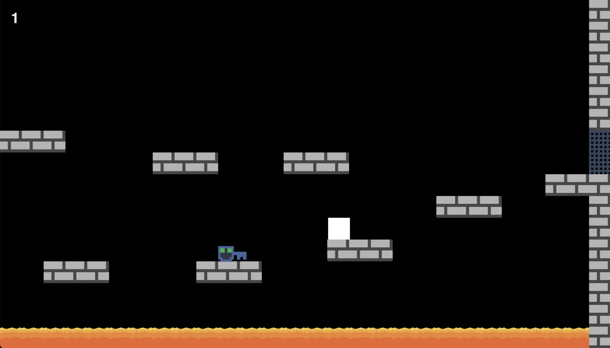
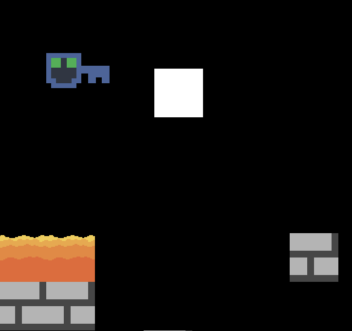
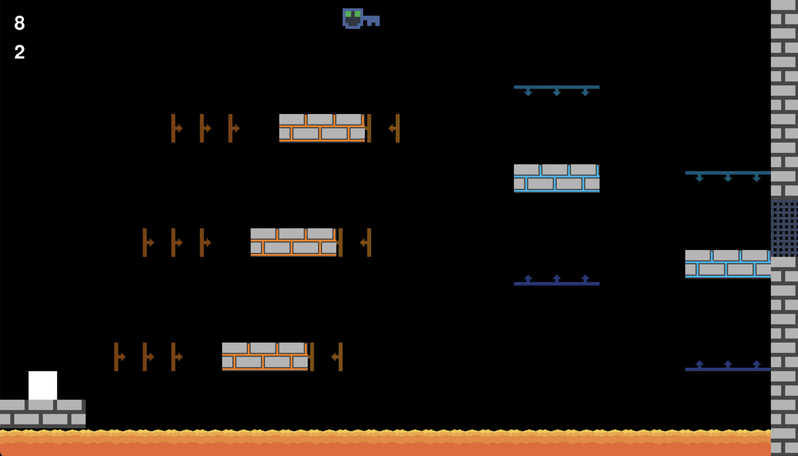

# Square Jumper
Welcome to Square Jumper! Can you, a simple white square, navigate towards and gather keys in each platforming challenge and progress to the next level without falling into the fiery pits of lava?

## Requirements
- pip 24.3.1
- Python 3.9.0
- pygame 2.5.2 (Type into terminal: `pip install pygame`)

## How to Run
1. Clone the Repository (Type into terminal: `git clone https://github.com/BunkeredG/SquareJumper.git`)
2. Navigate to the directory (Type into terminal: `cd SquareJumper`)
3. Run the code (Type into terminal: `python main.py`)

## Images

